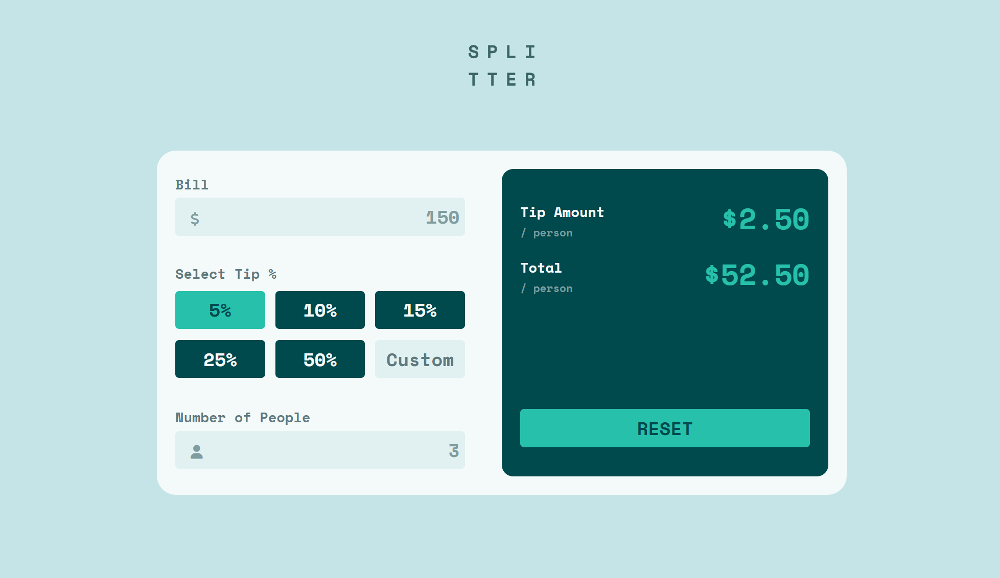

# Frontend Mentor - Tip calculator app solution

This is a solution to the [Tip calculator app challenge on Frontend Mentor](https://www.frontendmentor.io/challenges/tip-calculator-app-ugJNGbJUX). Frontend Mentor challenges help you improve your coding skills by building realistic projects.

## Overview

### Screenshot



### Links

- Live Site URL: [See the live page here](https://kasia307584.github.io/challenge_Tip-Calculator-App/)

### The challenge

Users should be able to:

- View the optimal layout for the app depending on their device's screen size
- See hover states for all interactive elements on the page
- Calculate the correct tip and total cost of the bill per person
- See the error message when invalid number input

## My process

### Built with

- Semantic HTML5 markup
- CSS custom properties
- Flexbox
- Mobile-first workflow
- Vanilla JS

### What I learned

- Use of CSS custom properties

```css
:root {
  --font-default: "Space Mono", monospace;
  --primary: hsl(172, 67%, 45%);
  --neutral-1: hsl(183, 100%, 15%);
  --neutral-2: hsl(186, 14%, 43%);
  --neutral-3: hsl(184, 14%, 56%);
  --neutral-4: hsl(185, 41%, 84%);
  --neutral-5: hsl(189, 41%, 97%);
}
body {
  background-color: var(--neutral-4);
  color: var(--neutral-2);
  margin: auto;
}
```

- Remove spin buttons (arrows) in numeric inputs added by Chrome and Firefox

```css
input[type="number"]::-webkit-inner-spin-button {
  -webkit-appearance: none;
}
input[type="number"] {
  -moz-appearance: textfield;
}
```

### Continued development

- Add regex to the custom input in order to validate the input as number or numer + % character

## Author

- Frontend Mentor - [See my solutions here](https://www.frontendmentor.io/profile/Kasia307584)
